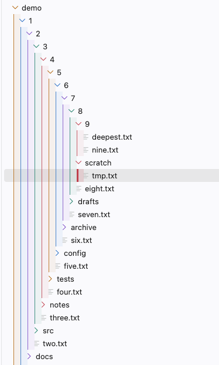

# Explorer Nesting Colors

Colors the Explorer's indent guides by nesting depth and draws the active folder's guide thicker. File and folder names keep your theme's colors.



> **This extension modifies VS Code's installation files.** VS Code's extension API can't color indent guides per depth, so the extension injects a stylesheet into `workbench.html`, the same way "Custom CSS and JS Loader" and APC do. Read [the corrupt-install warning](#the-installation-appears-to-be-corrupt-warning) and [Uninstalling](#uninstalling) before you enable it.

## Setup

```bash
npm install
npm run build      # esbuild bundle to dist/
npm test           # vitest
npm run package    # produces explorer-nesting-colors-<version>.vsix
code --install-extension explorer-nesting-colors-0.1.0.vsix
```

Then run **Explorer Nesting: Enable** from the Command Palette and reload when prompted.

To develop, open this folder in VS Code and press F5. Note that the dev Extension Host patches the *same* VS Code install you're running.

## Commands

| Command | What it does |
|---|---|
| Explorer Nesting: Enable | Writes the stylesheet, backs up and patches `workbench.html`, and sets `workbench.tree.renderIndentGuides: "always"` and `workbench.tree.indent`. |
| Explorer Nesting: Disable | Restores `workbench.html`, deletes the stylesheet, and restores your previous tree settings. |
| Explorer Nesting: Reload | Regenerates the stylesheet from your settings and reloads the window. |

When you change a setting, the extension regenerates the stylesheet and offers to reload. Switching themes needs no reload: the stylesheet includes the dark and light palette variants, each scoped to VS Code's theme class (`vs-dark`, `vs`, `hc-black`, `hc-light`).

## Settings

| Key | Default | |
|---|---|---|
| `explorerNesting.palette` | `"spectrum"` | `"spectrum"`, `"cool"`, `"themeAccent"`, or an array of hex colors used for every theme |
| `explorerNesting.guideWidth` | `1` | Guide width in px (1–3) |
| `explorerNesting.activeGuideWidth` | `3` | Active-folder guide width in px (2–6) |
| `explorerNesting.indent` | `12` | Tree indent in px (8–20), written to `workbench.tree.indent` |
| `explorerNesting.tintFolderIcons` | `true` | Tint folder twisties and font-based folder icons with their depth color |
| `explorerNesting.dimInactiveGuides` | `false` | Inactive guides at 40% opacity instead of 85% |
| `explorerNesting.sectionBackgrounds` | `"off"` | `"guides"` tints each indent column; `"full"` also tints each row with its parent folder's color |
| `explorerNesting.sectionOpacity` | `8` | Tint strength in percent (3–30). The active folder's band is doubled |
| `explorerNesting.fixChecksums` | `false` | Also patch `product.json` to suppress the corrupt-install warning |

The "active folder" is the one VS Code itself marks active: the focused or selected folder if it's expanded, otherwise the parent of the focused or selected item. Folder-icon tinting works with font-glyph icon themes (such as Seti). SVG icon themes can't be recolored with CSS.

## The "installation appears to be corrupt" warning

VS Code checks the files it ships against checksums in `product.json`. Once `workbench.html` is patched, VS Code shows **"Your Code installation appears to be corrupt. Please reinstall."** after a reload. Nothing is actually broken. You have two options:

1. **Dismiss it.** Choose "Don't Show Again" from the gear icon on the notification. It comes back after each VS Code update.
2. **Enable `explorerNesting.fixChecksums`.** The extension updates the `workbench.html` checksum in `product.json` to match the patched file, and keeps a backup that it restores on disable. This edits one more installation file.

On macOS, either option invalidates the app's code signature. This hasn't caused problems in practice for this class of extension, but be aware of it.

## Permissions

The extension needs write access to the VS Code installation:

- **macOS:** If enabling fails with a permission error, grant your VS Code app **App Management** in System Settings → Privacy & Security.
- **Windows:** The per-user installer (`%LOCALAPPDATA%\Programs`) works out of the box. A system install (`Program Files`) needs VS Code to be run as administrator once.
- **Linux:** Package-manager installs (`/usr/share/code`) are owned by root. Either `sudo chown -R $USER` the install directory or use the tarball. Snap installs are read-only and aren't supported.

## After VS Code updates

An update replaces `workbench.html`, which removes the colors. On the next startup the extension detects that its marker is missing and asks whether to re-apply.

## Uninstalling

**Run "Explorer Nesting: Disable" before you uninstall.** That's the only path that also restores your `workbench.tree.*` settings.

If you uninstall without disabling, the `vscode:uninstall` hook restores `workbench.html` (and `product.json`, if the extension changed it). VS Code runs that hook only after it fully restarts following the uninstall. It scans the standard install locations for VS Code stable, Insiders and VSCodium. A custom install location isn't found, so you'd have to restore it by hand.

To restore by hand, in `<app root>/out/vs/code/electron-browser/workbench/`:

1. Delete everything between `<!-- explorer-nesting:start -->` and `<!-- explorer-nesting:end -->` in `workbench.html`, or copy `workbench.html.explorer-nesting.bak` over it.
2. Delete `explorer-nesting.css`.
3. If `product.json.explorer-nesting.bak` exists next to `product.json`, copy it back.

Reinstalling VS Code also restores everything.

## How it works

`src/css.ts` is a pure function from settings to CSS. Against VS Code 1.134's Explorer DOM:

- Each row at `aria-level` L renders L−1 `.monaco-tl-indent > .indent-guide` spans. Guide `:nth-child(k)` belongs to the ancestor at level k, so it gets `palette[(k−1) % n]`.
- Guides are drawn with `border-left` on a `box-sizing: border-box` span, so width and color are set there.
- VS Code adds `.active` to the guides of the active folder's subtree, so the thicker line needs no script.
- The native guide rules are scoped by a per-list id, so the generated rules use `!important`.

`src/inject.ts` adds a `<link>` to a sibling `explorer-nesting.css` before `</head>`. The workbench CSP allows `style-src 'self'` but blocks inline scripts. A cache-busting query string makes reloads pick up the regenerated CSS.
